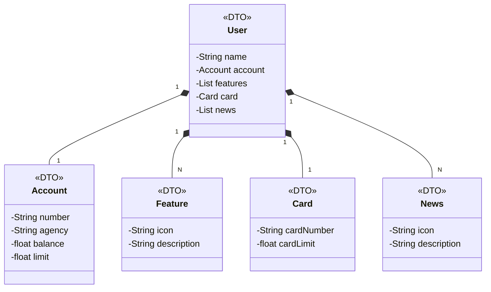

# test

```mermaid
classDiagram
    class User {
        <<DTO>>
        -String name
        -Account account
        -List<Feature> features
        -Card card
        -List<News> news
    }
    
    class Account {
        <<DTO>>
        -String number
        -String agency
        -float balance
        -float limit
    }
    
    class Feature {
        <<DTO>>
        -String icon
        -String description
    }
    
    class Card {
        <<DTO>>
        -String cardNumber
        -float cardLimit
    }
    
    class News {
        <<DTO>>
        -String icon
        -String description
    }
    
    User "1" *-- "1" Account
    User "1" *-- "N" Feature
    User "1" *-- "1" Card
    User "1" *-- "N" News

```
